# KailshiansX — Data Model v1.0

> Source of truth: [`prisma/schema.prisma`](../prisma/schema.prisma)  
> Migration: `prisma/migrations/…_init/migration.sql`

---

## Entity Relationship Overview

```mermaid
erDiagram
    User ||--o{ Account : "has"
    User ||--o{ Session : "has"
    User ||--o{ Registration : "makes"
    User ||--o{ Payment : "owns"
    User ||--o{ TeamApplication : "submits"
    User ||--o{ CampusLeadApplication : "submits"
    User ||--o{ StateLeadApplication : "submits"
    User ||--o| CampusLead : "becomes"
    User ||--o| StateLead : "becomes"
    User ||--o{ AuditLog : "generates"

    Series ||--o{ SeriesEdition : "has"
    SeriesEdition ||--|| Event : "links"

    Event ||--o{ EventScheduleItem : "has"
    Event ||--o{ EventTrack : "has"
    Event ||--o{ EventSpeaker : "has"
    Event ||--o{ EventPartner : "has"
    Event ||--o{ TicketType : "has"
    Event ||--o{ Registration : "receives"
    Event ||--o{ GalleryAlbum : "has"
    Event ||--o{ EventFaq : "has"
    Event ||--o{ EventRevenueItem : "has"
    Event ||--o{ EventExpenseItem : "has"
    Event ||--o{ Certificate : "issues"
    Event ||--o| TechTalkResource : "has"

    Speaker ||--o{ EventSpeaker : "appears_in"
    Speaker ||--o{ TechTalkResource : "presents"

    Partner ||--o{ EventPartner : "sponsors"

    TicketType ||--o{ Registration : "sold_as"
    Registration ||--o| Payment : "paid_via"
    Registration ||--o| Attendance : "checked_in_as"
    Registration ||--o| Certificate : "earns"

    GalleryAlbum ||--o{ GalleryImage : "contains"

    CampusLeadApplication ||--o| CampusLead : "converts_to"
    StateLeadApplication ||--o| StateLead : "converts_to"

    City ||--o{ Event : "hosts"
    City ||--o{ College : "contains"
    City ||--o{ CampusLead : "represents"
    City ||--o{ StateLead : "covers"
    City ||--o{ CollaborationLead : "located_in"

    College ||--o{ CampusLead : "has"

    CertificateTemplate ||--o{ Certificate : "used_by"
    ContentPage ||--o{ ContentBlock : "contains"
```

---

## Model Reference

### Auth & Identity

| Model | Purpose | Key Fields |
|-------|---------|------------|
| `User` | Platform user (any role) | `email`, `role`, `deletedAt` (soft delete) |
| `Account` | OAuth provider link (Auth.js) | `provider`, `providerAccountId` |
| `Session` | Active sessions (Auth.js) | `sessionToken`, `expires` |
| `VerificationToken` | Email magic link (Auth.js) | `identifier`, `token` |

**Role Enum:** `SUPER_ADMIN` > `ADMIN` > `EVENT_MANAGER` > `VIEWER` + `CAMPUS_LEAD` | `STATE_LEAD` | `MEMBER`

---

### Geography

| Model | Purpose | Notes |
|-------|---------|-------|
| `City` | City master (Jaipur, Chandigarh, Delhi…) | `name` unique; links events, leads, colleges |
| `College` | College master | Unique on `(name, cityId)` |

---

### Events

| Model | Purpose | Key Fields |
|-------|---------|------------|
| `Event` | Core event entity | `slug`, `type`, `status`, `startDate`, `cityId`, `deletedAt` |
| `EventScheduleItem` | Timed agenda slots | `startTime`, `endTime`, `speakerId` |
| `EventTrack` | Hackathon/parallel tracks | `name`, `color` |
| `EventFaq` | Per-event Q&A | `question`, `answer`, `sortOrder` |
| `EventSpeaker` | Event↔Speaker join (with role) | `role: SPEAKER\|JUDGE\|MENTOR` |
| `EventPartner` | Event↔Partner join (with tier) | `tier: TITLE\|GOLD\|SILVER\|BRONZE\|COMMUNITY\|MEDIA` |

**Event Types:** `MEETUP` | `HACKATHON` | `WORKSHOP` | `TECH_TALK` | `OTHER`  
**Event Statuses:** `DRAFT` → `PUBLISHED` → `ARCHIVED`

---

### Series

| Model | Purpose |
|-------|---------|
| `Series` | Named series (RaibarX, NirmanX, …) with `kind: MEETUP\|HACKATHON` |
| `SeriesEdition` | Join between `Series` and `Event`, with `editionNo` and optional `theme` |

**Seed data:** RaibarX, TricityX, PadharoX (meetups); NirmanX, AarambhX (hackathons)

---

### Speakers & Partners (Global Pools)

| Model | Key Fields |
|-------|------------|
| `Speaker` | `slug`, `designation`, `organisation`, `linkedin`, `twitter`, `github` |
| `Partner` | `slug`, `logo`, `website`, `category` |

Speakers and Partners are **global** — they're linked to specific events via `EventSpeaker` / `EventPartner` join tables with metadata (role/tier).

---

### Tickets & Registrations

| Model | Purpose | Key Fields |
|-------|---------|------------|
| `TicketType` | Ticket tier per event | `price`, `quota`, `saleStart`, `saleEnd`, `isFree` |
| `Registration` | Attendee booking | `registrationCode` (human-readable), `status`, `qrCodeUrl`, `checkedInAt` |
| `Payment` | Razorpay payment record | `razorpayOrderId`, `razorpayPaymentId`, `status`, `refundStatus` |
| `Attendance` | QR check-in record | `checkedInAt`, `method: QR\|MANUAL` |

**Registration flow:** `TicketType` selected → `Registration` created (PENDING) → `Payment` created → on capture → Registration → CONFIRMED → at event → `Attendance` record

---

### Gallery

| Model | Purpose |
|-------|---------|
| `GalleryAlbum` | Named album per event or standalone | `category: meetup\|hackathon\|workshop\|tech-talk\|community\|bts` |
| `GalleryImage` | Individual photo | `url`, `thumbUrl`, `caption`, `altText`, `sortOrder` |

---

### Community Programs

#### Campus Leads (PRD §11)

| Model | Workflow |
|-------|---------|
| `CampusLeadApplication` | Form submission → status: `APPLIED → SCREENING → INTERVIEW → SELECTED` |
| `CampusLead` | Active lead record (created on SELECTED) → `ACTIVE → ALUMNI \| INACTIVE` |

#### State Leads (PRD §12)

| Model | Workflow |
|-------|---------|
| `StateLeadApplication` | Form submission → same 5-stage workflow |
| `StateLead` | Covers a `state`, linked to `City[]` |

Both have `honeypot` field for spam protection.

---

### Collaborations (PRD §13)

| Model | Purpose |
|-------|---------|
| `CollaborationLead` | CRM-lite pipeline | `type: COLLEGE\|COMMUNITY\|VENUE\|SPONSOR`, `stage: LEAD → CONTACTED → NEGOTIATING → CONFIRMED` |

---

### Team & Organisation

| Model | Purpose |
|-------|---------|
| `TeamApplication` | Join Team form (PRD §14) — area, status `NEW → REVIEWING → INTERVIEW → SELECTED\|REJECTED` |
| `CoreTeamMember` | Published team directory | `category`, `isActive`, `deletedAt` |
| `FounderContent` | CMS for Founder page | `milestones` (JSON), `philosophy`, `message` |

---

### Certificates

| Model | Purpose |
|-------|---------|
| `CertificateTemplate` | Base template with `fields` JSON (position, font, color per field) |
| `Certificate` | Issued cert — `uniqueId` for public verification, `certificateUrl` (S3 generated) |

---

### Finance (PRD §23)

| Model | Purpose | Categories |
|-------|---------|------------|
| `EventRevenueItem` | Line-item revenue | `TICKET \| SPONSORSHIP \| MERCH \| OTHER` |
| `EventExpenseItem` | Line-item expense | `VENUE \| TRAVEL \| FOOD \| SWAG \| MARKETING \| PRINTING \| OPERATIONS \| LOGISTICS \| OTHER` |

Totals are computed at query time (SUM) — no denormalized totals to stay in sync.

---

### CMS

| Model | Purpose |
|-------|---------|
| `ContentPage` | URL-mapped page (slug) | isPublished, metaTitle, metaDesc |
| `ContentBlock` | Ordered block inside a page | `type: HERO\|TEXT\|IMAGE\|VIDEO\|FAQ\|CTA\|TESTIMONIAL\|STATS\|TEAM_GRID\|EVENT_LIST`, `data: Json` |

---

### Audit

| Model | Purpose |
|-------|---------|
| `AuditLog` | Immutable change log | `action`, `entityType`, `entityId`, `before`, `after`, `ipAddress` |

---

## Indexes Summary

| Table | Indexes |
|-------|---------|
| `User` | `email` (unique), `role` |
| `Event` | `slug` (unique), `status`, `type`, `startDate`, `cityId` |
| `Registration` | `eventId`, `email`, `userId`, `status`, `registrationCode` (unique) |
| `Payment` | `razorpayOrderId` (unique), `razorpayPaymentId` (unique), `status`, `userId` |
| `Series` | `slug` (unique), `kind` |
| `SeriesEdition` | `(seriesId, editionNo)` (unique), `eventId` (unique) |
| `AuditLog` | `userId`, `(entityType, entityId)`, `createdAt` |

---

## Soft Delete Policy

Models with `deletedAt DateTime?`:
- `User` — never hard-delete users (audit trail)
- `Event` — keep slug, registrations intact
- `CollaborationLead` — keep pipeline history
- `ContentPage` — keep URL ownership
- `CoreTeamMember` — keep history

Models without soft delete use **cascade** `onDelete` at the relation level (e.g., `EventSpeaker` → cascade on Event delete).

---

## Seed Data Summary

| Entity | Count | Details |
|--------|-------|---------|
| Cities | 3 | Jaipur, Chandigarh, Delhi |
| Colleges | 3 | MNIT Jaipur, PEC Chandigarh, IIT Delhi |
| Speakers | 4 | Rahul (Google), Priya (Microsoft), Arjun (Devstack), Deepa (Razorpay) |
| Partners | 3 | TechCorp, Startup India, GitHub |
| Series | 5 | RaibarX, TricityX, PadharoX (meetup); NirmanX, AarambhX (hackathon) |
| Events | 6 | 2× RaibarX, TricityX-01, NirmanX-01, AarambhX-01, Cloud Workshop |
| Ticket Types | 8 | Free + paid tiers across events |
| Schedule Items | 5 | RaibarX-01 full agenda |
| FAQs | 5 | NirmanX-01 |
| Tracks | 4 | NirmanX-01 (Civic, Agri, Ed, Open) |
| Gallery Images | 3 | RaibarX-01 album |
| Revenue Items | 4 | NirmanX-01 (tickets + sponsors) |
| Expense Items | 6 | NirmanX-01 (venue, food, swag, etc.) |
| Core Team | 3 | Founder, Community Head, Lead Engineer |
| Certificate Template | 1 | Standard KailshiansX template |
